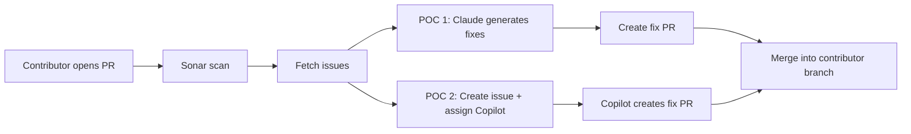
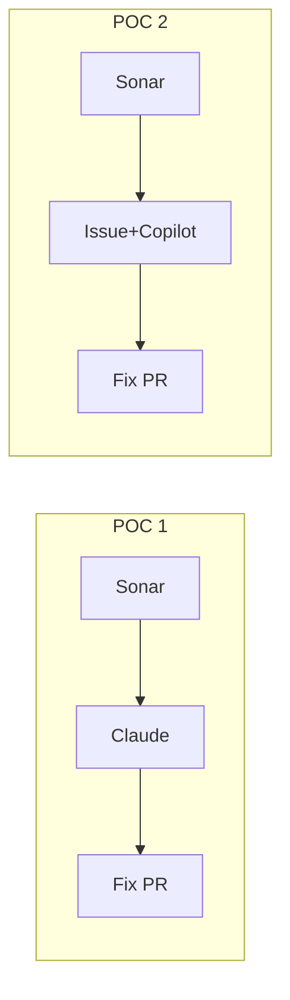
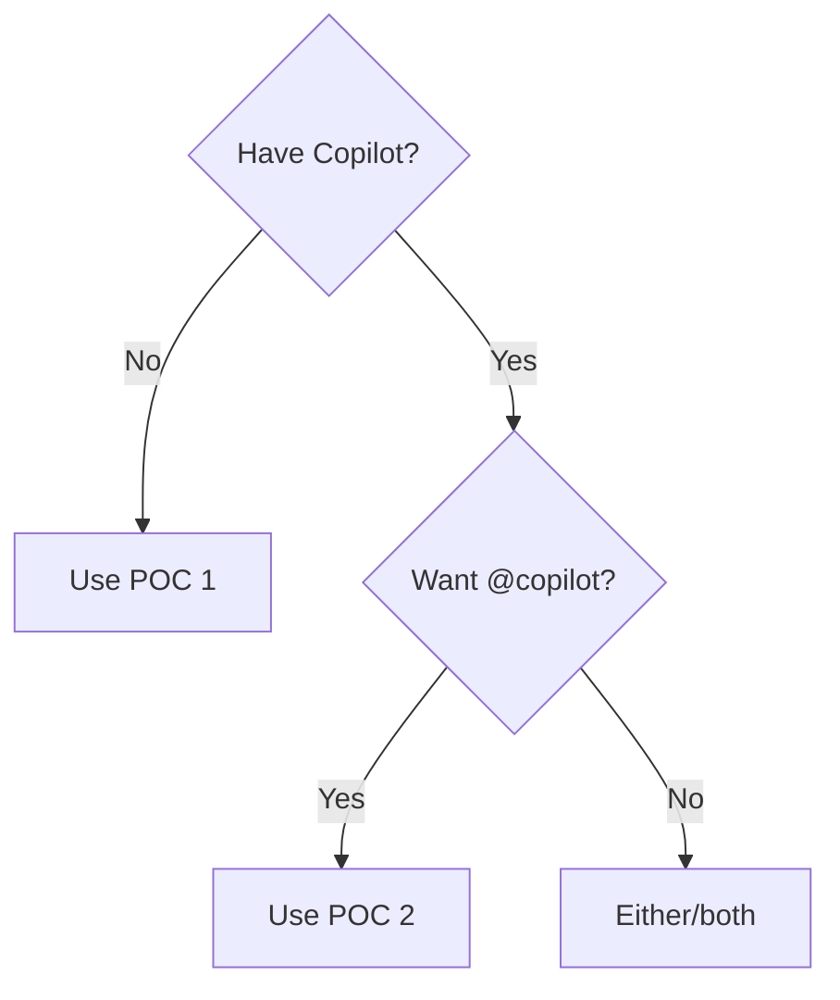

# POC Findings: Autonomous SonarQube Fixes via AI Agents

**Document type:** POC findings report  
**Audience:** Platform teams, repo maintainers, EMs/TPMs evaluating AI-assisted quality workflows  
**Repository:** [mohdashraf010897/auto-sonar-poc](https://github.com/mohdashraf010897/auto-sonar-poc)  
**Scope:** Two approaches to automatically fix SonarQube issues on contributor pull requests  

This page summarizes two proof-of-concept implementations that automatically generate fix pull requests when SonarQube reports issues on a contributor's PR. Both POCs ran successfully; this report provides an executive summary, flows, findings, and recommendations for adoption.

---

## Table of contents

- Executive summary  
- 1. Problem statement and objectives  
- 2. End-to-end flow  
- 3. POC 1: In-repo Claude + GitHub Action  
- 4. POC 2: GitHub Copilot (Agents on GitHub)  
- 5. Comparison and decision guide  
- 6. Key findings and lessons learned  
- 7. Recommendations  
- 8. References and artifacts  
- 9. Risks and guardrails  
- Document control  

---

## How to use this page

| If you want to… | Go to |
|-----------------|------|
| Get the bottom line in 30 seconds | Executive summary |
| Understand the problem and goals | Section 1 |
| See how each approach works | Sections 3 and 4 |
| Choose which POC to use | Section 5.2 (decision guide) |
| Implement or run one of the POCs | Section 5.3 and Section 8 |
| See what we learned and what to do next | Sections 6 and 7 |
| See POC 2 conversation and coding standards | Sections 4.4–4.5 |

---

## Executive summary

**Bottom line:** Both approaches work. POC 1 (Claude in GitHub Actions) requires no Copilot license; POC 2 (GitHub Copilot coding agent) requires Copilot and supports conversation on the fix PR via `@copilot`. Use the decision guide in Section 5.2.

| POC | Approach | Outcome | Best for |
|-----|----------|---------|---------|
| **POC 1** | In-repo: Sonar → Claude → GitHub Action creates fix PR | ✅ Validated | Teams without Copilot; full in-repo control |
| **POC 2** | Sonar → create issue → assign to Copilot → Copilot opens fix PR | ✅ Validated | Teams with Copilot; conversation on PR via `@copilot` |

**Key result:** Contributor opens PR → Sonar reports issues → agent creates fix PR targeting contributor's branch → contributor merges → original PR is clean.

---

## 1. Problem statement and objectives

### 1.1 Problem
- Contributors open PRs; SonarQube reports code quality issues
- Manual fixes are repetitive and slow feedback loops
- Goal: Automated fix PRs so contributors get ready-to-merge fixes

### 1.2 Objectives
| # | Objective | Success criteria |
|---|-----------|------------------|
| 1 | Automate "Sonar issues → fix PR" | Fix PR created, targets correct branch |
| 2 | Validate Claude path | Build/lint pass; mergeable |
| 3 | Validate Copilot path | Copilot opens fix PR |
| 4 | Avoid loops | Fix PRs don't re-trigger workflows |

### 1.3 Prerequisites
- GitHub repo with Actions enabled
- SonarQube/SonarCloud configured
- POC 1: Anthropic API key
- POC 2: Copilot subscription + user PAT

---

## 2. End-to-end flow (both POCs)

---

## 3. POC 1: In-repo Claude + GitHub Action

**Workflow:** `.github/workflows/sonar-ai-fix.yml` runs on PRs/push to main

**How it works:**
1. Sonar scan → fetch issues via API
2. `scripts/ai-fix-sonar.js` calls Claude with file context
3. Apply fixes (bottom-to-top by line), run build/lint
4. `peter-evans/create-pull-request` → fix PR targeting contributor's branch

**Key details:**
| Component | Details |
|-----------|---------|
| Secrets | `SONAR_TOKEN`, `SONAR_HOST_URL`, `ANTHROPIC_API_KEY` |
| Loop prevention | Skip `copilot-swe-agent` PRs and `sonar-ai-fixes-*` branches |
| Local testing | `pnpm run sonar-fix:local` |

**Findings:** ✅ Fix PR created, targets correct branch, build/lint passes

**Limitations:** 100 issue cap, Claude context limits, API costs scale with issues

---

## 4. POC 2: GitHub Copilot (Agents on GitHub)

**Workflow:** `.github/workflows/sonar-copilot-agent-poc.yml`

**How it works:**
1. Sonar scan → fetch issues
2. `scripts/trigger-copilot-via-issue.js` creates GitHub issue + assigns to Copilot via GraphQL
3. Copilot picks up issue, creates fix PR (baseRef = contributor's branch)
4. Review/merge; use `@copilot` for iteration

**Key details:**
| Component | Details |
|-----------|---------|
| Secret | `COPILOT_ASSIGNMENT_TOKEN` (user PAT required) |
| Custom agents | `.github/agents/sonar-fix-standards.agent.md` |
| Repo instructions | `.github/copilot-instructions.md` |

**Validated conversation** (PR #9):
- `@copilot add comments` → Copilot commits comments + responds
- Review comments → Copilot reacts, retains context

**Findings:** ✅ Issue assigned, Copilot creates PR, conversation works, custom agents apply standards

**Limitations:** Requires Copilot license, user PAT (not GITHUB_TOKEN), GitHub controls timing

---

## 5. Comparison and decision guide

### 5.1 Side-by-side

| Dimension | POC 1 (Claude) | POC 2 (Copilot) |
|-----------|----------------|-----------------|
| Licensing | Anthropic API | Copilot subscription |
| Secrets | `ANTHROPIC_API_KEY` | User PAT |
| Iteration | Re-run workflow | `@copilot` conversation |
| Standards | Script prompt | Custom agents + repo instructions |
| Cost | Per API call | Subscription |

### 5.2 Decision guide

### 5.3 Quick start

| | POC 1 | POC 2 |
|-|-------|-------|
| **Workflow** | `sonar-ai-fix.yml` | `sonar-copilot-agent-poc.yml` |
| **Secrets** | `SONAR_*`, `ANTHROPIC_*` | `SONAR_*`, `COPILOT_ASSIGNMENT_TOKEN` |
| **Start here** | Add Anthropic key | Add user PAT + enable Copilot |

---

## 6. Key findings

1. **Target contributor's branch** - Checkout PR head so fix PR merges into contributor's work
2. **Reverse line order** - Apply fixes bottom-to-top to avoid offset issues  
3. **Loop prevention** - Skip `copilot-swe-agent` and `sonar-ai-fixes-*` branches
4. **Copilot needs user PAT** - `GITHUB_TOKEN` can't assign to Copilot
5. **@copilot works well** - Retains context, opens follow-up PRs
6. **Custom agents scale** - `.github/agents/*.agent.md` for standards

---

## 7. Recommendations

| Priority | Action |
|----------|--------|
| **High** | Pick one/both based on licensing; document decision |
| **High** | Keep loop prevention when running both |
| **Medium** | POC 1: Cap Claude issues per run |
| **Medium** | POC 2: Custom agent + repo instructions |
| **Low** | Extend to review comments (future) |

---

## 8. Artifacts

| File | Purpose |
|------|---------|
| `sonar-ai-fix.yml` | POC 1 workflow |
| `sonar-copilot-agent-poc.yml` | POC 2 workflow |
| `ai-fix-sonar.js` | Claude fix generation |
| `trigger-copilot-via-issue.js` | Copilot issue assignment |
| `sonar-fix-standards.agent.md` | Custom agent |
| `copilot-instructions.md` | Repo standards |

---

## 9. Risks and guardrails

**Security:**
- Scope PATs minimally, store in GitHub secrets only
- AI calls leave infra; validate data policies

**Reliability:**
- Workflows fail gracefully if services unavailable
- Alert on repeated failures

**Governance:**
- Opt-in per repo/team
- Clear ownership for workflows/prompts

---

## Document control

| Item | Value |
|------|-------|
| Version | 1.3 (3 diagrams) |
| Status | Final |
| Repository | [mohdashraf010897/auto-sonar-poc](https://github.com/mohdashraf010897/auto-sonar-poc) |
